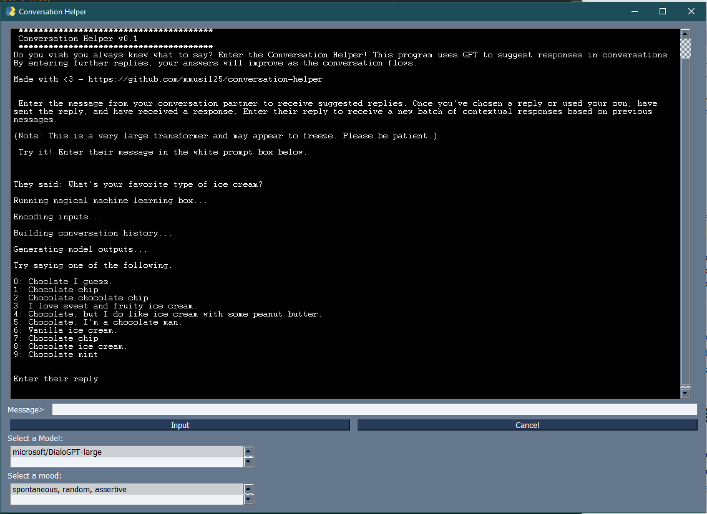
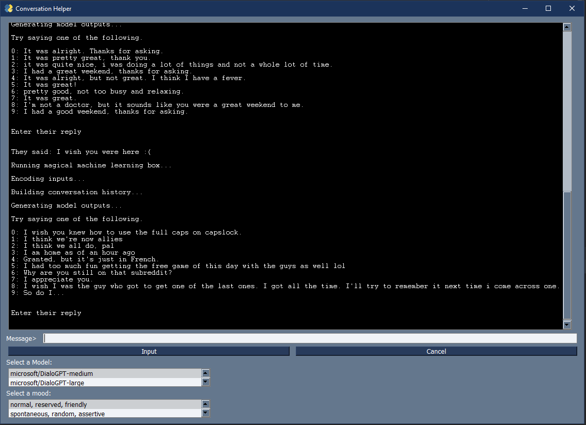

# conversation-helper
GUI implementation of a Transformer chatbot. Suggests amicable responses to messages from friends. 

## Screenshots






## Upcoming Release Improvements
* Conversation logging
* Display conversational meta information (greeting, question, suggestion, statement, etc.) and likelihood of a certain meta token for a given draft message. 
* Hyperparameter tuning via the GUI
* Sentiment analysis for your drafted message
* Bayesian prediction of how they will reply based on their previous replies 

## usage

Do you wish you always knew what to say? Enter the Conversation Helper! This program uses GPT to suggest responses in
conversations. By entering further replies, your answers will improve as the conversation flows.

Enter the message from your conversation partner to receive suggested replies. Once you've chosen a reply or
used your own, have sent the reply, and have received a response, Enter their reply to receive a new batch of 
contextual responses based on previous messages.

**Note**: This is a very large transformer and may appear to freeze. Please be patient. 

Made with <3 by [Mark](https://www.linkedin.com/in/mark-musil/)

Install dependencies via requirements.txt

```
pip install -r requirements.txt
```

Run GUI.py and follow the instructions printed at start up :)

```
python3 GUI.py
```

For the experimental release (where I'm doing most of my hyperparameter tuning and experimentation)

```
python3 main.py
```
## Credit to the following online resources

[How to generate text: using different decoding methods for language generation with Transformers](https://huggingface.co/blog/how-to-generate)

[Conversational AI Chatbot with Transformers in Python](https://www.thepythoncode.com/article/conversational-ai-chatbot-with-huggingface-transformers-in-python)